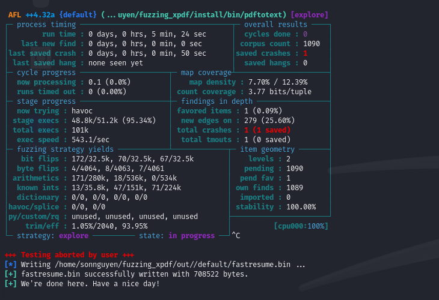

# Binary Fuzzing Lab Task
For this lab task, we will fuzz Xpdf PDF viewer. 
The goal is to reproduce a crash for CVE-2019-13288 in XPDF 3.02.

## Learning goal
1. Compile the target code to binary with AFL++ instrumentation 
2. Fuzz target with AFL++
3. Triaging crashes with GDB debugger

## Environment setup
1. AFL++
The fuzzing exercise was conducted on a Kali Linux system

* Install AFL++:
```
git clone https://github.com/AFLplusplus/AFLplusplus.git
cd AFLplusplus
make distrib
sudo make install
```

* Verify AFL++ setup by:
```
afl-fuzz
```
  * The parameter set
    

2. Setup XPDF 3.02
* Create a new directory for the project you want to fuzz:
```
cd $HOME
mkdir fuzzing_xpdf && cd fuzzing_xpdf/
```
* Install additional tools
```
sudo apt install build-essential
```
* Download Xpdf 3.02
```
wget https://dl.xpdfreader.com/old/xpdf-3.02.tar.gz
tar -xvzf xpdf-3.02.tar.gz
```
* Verify Xpdf installation with example pdf file
```
cd xpdf-3.02
sudo apt update && sudo apt install -y build-essential gcc
./configure --prefix="$HOME/fuzzing_xpdf/install/"
make
make install
```
```
cd $HOME/fuzzing_xpdf
mkdir pdf_examples && cd pdf_examples
wget https://www.melbpc.org.au/wp-content/uploads/2017/10/small-example-pdf-file.pdf
```
```
$HOME/fuzzing_xpdf/install/bin/pdfinfo -box -meta $HOME/fuzzing_xpdf/pdf_examples/small-example-pdf-file.pdf
```
Explanation:
- pdfinfo: A binary file to extract information from PDF files
- box: Displays information about page dimensions and media boxes
- meta: Reveals embedded metadata about the document

Result:


If you go here without any errors, then your environment is ready to fuzz...

## Fuzzing
To fuzz Xpdf with AFL++, we needed to compile Xpdf with instrumentation so that AFL++ could track coverage. The fuzzing setup consisted of the following steps:

First of all, we’re going to clean all previously compiled object files and executables
```
rm -r $HOME/fuzzing_xpdf/install
cd $HOME/fuzzing_xpdf/xpdf-3.02/
make clean
```

And now we’re going to build xpdf using the afl-clang-fast compiler. Refer [Fuzzing in Depth - AFL++ Documentation](https://github.com/AFLplusplus/AFLplusplus/blob/stable/docs/fuzzing_in_depth.md) for more compiler selection
```
export LLVM_CONFIG="llvm-config-16"
CC=$HOME/AFLplusplus/afl-clang-fast CXX=$HOME/AFLplusplus/afl-clang-fast++ ./configure --prefix="$HOME/fuzzing_xpdf/install/"
make
make install
```
Now, you can run the fuzzer with the following command:
```
afl-fuzz -i $HOME/fuzzing_xpdf/pdf_examples/ -o $HOME/fuzzing_xpdf/out/ -s 123 -- $HOME/fuzzing_xpdf/install/bin/pdftotext @@ $HOME/fuzzing_xpdf/output
```
Explanation of each option:

* -i Specifies the directory for input cases (example files)
* -o Specifies the directory where AFL++ will store mutated files
* -s Sets a static random seed for reproducibility
* @@ A placeholder in the target’s command line that AFL replaces with each input file name

Essentially, the fuzzer will execute:/home/kali/fuzzing_xpdf/install/bin/pdftotext <input-file-name> /home/kali/fuzzing_xpdf/outputfor each input file.

Depending on the power of your virtual machine, you will see the first hangs and crashes over time
You will see the ‘saved crashes’ value in red, indicating the number of crashes found. These crash files are stored in the /home/kali/fuzzing_xpdf/out/ directory. You can stop the fuzzer after finding the first crash by press Ctrl+C



How to Reproduce the Crash
To reproduce the crash, locate the file corresponding to the crash in the $HOME/fuzzing_xpdf/out/default/crashes directory.

In my case, the crash filename is id:000000,sig:11,src:000000,time:274008,execs:87328,op:havoc,rep:2

```
$HOME/fuzzing_xpdf/install/bin/pdftotext "$HOME/fuzzing_xpdf/out/default/crashes/<your_filename>" "$HOME/fuzzing_xpdf/output"
```


## Notes
<details>
  <summary>Click to expand</summary>
  This project is a demo for learning Markdown in GitHub. 📝
</details>

## Reference
Thanks to Antonio Morales for publishing the original materials on GitHub

